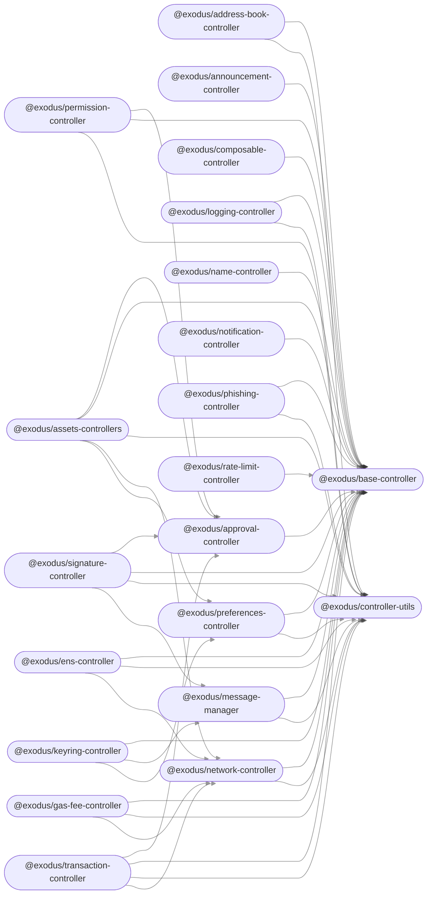

<h1 vertical-align="middle">Exodus
    <a targe="_blank" href="https://twitter.com/home?status=Exodus%20%E2%80%93%20Painless%20relocation%20of%20Linux%20binaries%20without%20containers!%20%40IntoliNow%0A%0Ahttps%3A//github.com/intoli/exodus">
        </a>
    <a target="_blank" href="https://www.facebook.com/sharer/sharer.php?u=https%3A//github.com/intoli/exodus">
        </a>
    <a target="_blank" href="http://reddit.com/submit?url=https%3A%2F%2Fgithub.com%2Fintoli%2Fexodus&title=Exodus%20-%20Painless%20relocation%20of%20ELF%20binaries%20on%20Linux">
        </a>
    <a target="_blank" href="https://news.ycombinator.com/submitlink?u=https://github.com/intoli/exodus&t=Exodus%20%E2%80%93%20Painless%20relocation%20of%20Linux%20binaries%20without%20containers">
</h1>

<p align="left">
    <a href="https://circleci.com/gh/intoli/exodus/tree/master">
        </a>
    <a href="https://circleci.intoli.com/artifacts/intoli/exodus/coverage-report/index.html">
        </a>
    <a href="https://github.com/intoli/exodus/blob/master/LICENSE.md">
        </a>
    <a href="https://pypi.python.org/pypi/exodus-bundler/">
        </a>
</p>


## Information
I was annoyed with the way the Exodus team had auto-updaters for Mac and Windows but not for Ubuntu. So I wrote my own. It may be a bit kludgy, but it works.Probably the best way to implement this is to store it in a scripts folder and add it to your crontab for daily execution.




## Usage

### Command-Line Interface

The command-line interface supports the following options.

```
usage: exodus [-h] [-c CHROOT_PATH] [-a DEPENDENCY] [-d] [--no-symlink FILE]
              [-o OUTPUT_FILE] [-q] [-r [NEW_NAME]] [--shell-launchers] [-t]
              [-v]
              EXECUTABLE [EXECUTABLE ...]

Bundle ELF binary executables with all of their runtime dependencies so that
they can be relocated to other systems with incompatible system libraries.

positional arguments:
  EXECUTABLE            One or more ELF executables to include in the exodus
                        bundle.

optional arguments:
  -h, --help            show this help message and exit
  -c CHROOT_PATH, --chroot CHROOT_PATH
                        A directory that will be treated as the root during
                        linking. Useful for testing and bundling extracted
                        packages that won't run without a chroot. (default:
                        None)
  -a DEPENDENCY, --add DEPENDENCY, --additional-file DEPENDENCY
                        Specifies an additional file to include in the bundle,
                        useful for adding programatically loaded libraries and
                        other non-library dependencies. The argument can be
                        used more than once to include multiple files, and
                        directories will be included recursively. (default:
                        [])
  -d, --detect          Attempt to autodetect direct dependencies using the
                        system package manager. Operating system support is
                        limited. (default: False)
  --no-symlink FILE     Signifies that a file must not be symlinked to the
                        deduplicated data directory. This is useful if a file
                        looks for other resources based on paths relative its
                        own location. This is enabled by default for
                        executables. (default: [])
  -o OUTPUT_FILE, --output OUTPUT_FILE
                        The file where the bundle will be written out to. The
                        extension depends on the output type. The
                        "{{executables}}" and "{{extension}}" template strings
                        can be used in the provided filename. If omitted, the
                        output will go to stdout when it is being piped, or to
                        "./exodus-{{executables}}-bundle.{{extension}}"
                        otherwise. (default: None)
  -q, --quiet           Suppress warning messages. (default: False)
  -r [NEW_NAME], --rename [NEW_NAME]
                        Renames the binary executable(s) before packaging. The
                        order of rename tags must match the order of
                        positional executable arguments. (default: [])
  --shell-launchers     Force the use of shell launchers instead of attempting
                        to compile statically linked ones. (default: False)
  -t, --tarball         Creates a tarball for manual extraction instead of an
                        installation script. Note that this will change the
                        output extension from ".sh" to ".tgz". (default:
                        False)
  -v, --verbose         Output additional informational messages. (default:
                        False)
```

### Backers

<a href="https://opencollective.com/democracyearth/backer/0/website"></a>
<a href="https://opencollective.com/democracyearth/backer/1/website"></a>
<a href="https://opencollective.com/democracyearth/backer/2/website"></a>
<a href="https://opencollective.com/democracyearth/backer/3/website"></a>
<a href="https://opencollective.com/democracyearth/backer/4/website"></a>
<a href="https://opencollective.com/democracyearth/backer/5/website"></a>
<a href="https://opencollective.com/democracyearth/backer/6/website"></a>
<a href="https://opencollective.com/democracyearth/backer/7/website"></a>
<a href="https://opencollective.com/democracyearth/backer/8/website"></a>
<a href="https://opencollective.com/democracyearth/backer/9/website"></a>
<a href="https://opencollective.com/democracyearth/backer/10/website"></a>
<a href="https://opencollective.com/democracyearth/backer/11/website"></a>

## Contributing

Contributions are welcome, but please follow these contributor guidelines outlined in [CONTRIBUTING.md](CONTRIBUTING.md).

## License

Exodus is licensed under a [BSD 2-Clause License](LICENSE.md) and is copyright [Intoli, LLC](https://intoli.com).

### Methods

### `coinList()`

Get the current list of all cryptocurrencies and the following information about each coin.

`coinList()`

- `No parameters`
- `Returns` (Object)...
  - `BaseImageUrl` (String) The base url for all the images from the ImageUrl field (https://www.cryptocompare.com),
  - `BaseLinkUrl` The base url for all the links from the Url field (https://www.cryptocompare.com)
  - `Data` (Object) Contains the following infomration about each coin.
    - `Id` (String)
    - `Url` (String) Url to the CryptoCompare page for the coin. (Ex: `/coins/eth/overview`) Url must be appended to `https://www.cryptocompare.com`.
    - `ImageUrl` (String) Url to get the coin logo image. (Ex: `/media/351001/404.png`). Url must be appended to `https://www.cryptocompare.com`.
    - `Name` (String) Ticker name of the given cryptocurrency.
    - `Symbol` (String) Ticker symbol of the given cryptocurrency (usually the same as the name).
    - `CoinName` (String) Name of the given cryptocurrency.
    - `FullName` (String) Name of the given cryptocurrency concatenated with the symbol (Ex: `Ethereum (ETH)`).
    - `Algorithm` (String) Name cryptographic algorithm for that coin.
    - `ProofType` (String) The proof type of the cryptocurrency.
    - `ProofType` (String) The proof type of the cryptocurrency.
    - `FullyPremined` (String) Returns "1" if the coin was premined, if not it returns "0".
    - `TotalCoinSupply` (String) Total supply of the cryptocurrency.
    - `PreMinedValue` (String) Value of premined coins.
    - `TotalCoinsFreeFloat` (String)
    - `SortOrder` (String) The order CryptoCompare ranks the coin inside their internal system.
    - `Sponsored` (Boolean) Is `true` when the coin is sponsored by CryptoCompare, is `false` otherwise.

```js
const cc = require('cryptocompare')
cc.setApiKey('<your-api-key>')

// Usage:
cc.coinList()
.then(coinList => {
  console.log(coinList)
  // ->
  // {
  //   BTC: {
  //    Id: "1182",
  //    Url: "/coins/btc/overview",
  //    ImageUrl: "/media/19633/btc.png",
  //    Name: "BTC",
  //    Symbol: "BTC",
  //    CoinName: "Bitcoin",
  //    FullName: "Bitcoin (BTC)",
  //    Algorithm: "SHA256",
  //    ProofType: "PoW",
  //    FullyPremined: "0",
  //    TotalCoinSupply: "21000000",
  //    PreMinedValue: "N/A",
  //    TotalCoinsFreeFloat: "N/A",
  //    SortOrder: "1",
  //    Sponsored: false
  // },
  //   ETH: {...},
  // }
})
.catch(console.error)
```

### `exchangeList()`

Returns all the exchanges that CryptoCompare has integrated with.

`exchangeList()`

- `No parameters`
- `Returns` (Object)

```js
const cc = require('cryptocompare')
cc.setApiKey('<your-api-key>')

// Usage:
cc.exchangeList()
.then(exchangeList => {
  console.log(exchangeList)
  // {
  //   "Cryptsy":
  //   {
  //     "42":["BTC","XRP"],
  //     "EMC2":["BTC","XRP"],
  //     "POINTS":["BTC"],
  //     "VTC":["BTC","LTC","XRP"]
  //     ...
  //   }
  //   ...
  // }
})
.catch(console.error)
```

### `price()`

Get the current price of any cryptocurrency in any other currency.

`price(fsym, tsyms[, options])`

- `fsym` (String) From Symbol
- `tsyms` (Array of Strings | String) To Symbol(s)
- `options` (Object)
  - `tryConversion` (Boolean) By default, if the crypto does not trade directly into the toSymbol requested, BTC will be used for conversion. Set `tryConversion` to `false` to disable using BTC for conversion.
  - `exchanges` (Array of Strings | Array) Exchanges to get price data from. By default, average data is used. (You can get a list of top exchanges for a given pair with `topExchanges()`.)

```js
const cc = require('cryptocompare')
cc.setApiKey('<your-api-key>')

// Basic Usage:
cc.price('BTC', ['USD', 'EUR'])
.then(prices => {
  console.log(prices)
  // -> { USD: 1100.24, EUR: 1039.63 }
})
.catch(console.error)

// Passing a single pair of currencies:
cc.price('BTC', 'USD')
.then(prices => {
  console.log(prices)
  // -> { USD: 1100.24 }
})
.catch(console.error)
```

### `priceMulti()`

Works like `price()`, except it allows you to specify a matrix of From Symbols.

`priceMulti(fsyms, tsyms[, options])`

- `fsyms` (Array of Strings | String) From Symbol(s)
- `tsyms` (Array of Strings | String) To Symbol(s)
- `options` (Object)
  - `tryConversion` (Boolean) By default, if the crypto does not trade directly into the toSymbol requested, BTC will be used for conversion. Set `tryConversion` to `false` to disable using BTC for conversion.
  - `exchanges` (Array of Strings | Array) Exchanges to get price data from. By default, average data is used. (You can get a list of top exchanges for a given pair with `topExchanges()`.)

```js
const cc = require('cryptocompare')
cc.setApiKey('<your-api-key>')

// Basic Usage:
cc.priceMulti(['BTC', 'ETH'], ['USD', 'EUR'])
.then(prices => {
  console.log(prices)
  // -> { BTC: { USD: 1114.63, EUR: 1055.82 },
  //      ETH: { USD: 12.74, EUR: 12.06 } }
})
.catch(console.error)

// Passing a single pair of currencies:
cc.priceMulti('BTC', 'USD')
.then(prices => {
  console.log(prices)
  // -> { BTC: { USD: 1114.63 } }
})
.catch(console.error)
```

### `priceFull()`

Get all the current trading info (price, vol, open, high, low, etc.) of any list of cryptocurrencies in any other currency.

`priceFull(fsyms, tsyms[, options])`

- `fsyms` (Array of Strings | String) From Symbol(s)
- `tsyms` (Array of Strings | String) To Symbol(s)
- `options` (Object)
  - `tryConversion` (Boolean) By default, if the crypto does not trade directly into the toSymbol requested, BTC will be used for conversion. Set `tryConversion` to `false` to disable using BTC for conversion.
  - `exchanges` (Array of Strings | Array) Exchanges to get price data from. By default, average data is used. (You can get a list of top exchanges for a given pair with `topExchanges()`.)

```js
const cc = require('cryptocompare')
cc.setApiKey('<your-api-key>')

cc.priceFull(['BTC', 'ETH'], ['USD', 'EUR'])
.then(prices => {
  console.log(prices)
  // {
  //   BTC: {
  //     USD: {
  //       TYPE: '5',
  //       MARKET: 'CCCAGG',
  //       FROMSYMBOL: 'BTC',
  //       TOSYMBOL: 'USD',
  //       FLAGS: '4',
  //       PRICE: 1152.42,
  //       LASTUPDATE: 1487865689,
  //       LASTVOLUME: 0.21,
  //       LASTVOLUMETO: 242.20349999999996,
  //       LASTTRADEID: 1224703,
  //       VOLUME24HOUR: 53435.45299122338,
  //       VOLUME24HOURTO: 60671593.843186244,
  //       OPEN24HOUR: 1119.31,
  //       HIGH24HOUR: 1170,
  //       LOW24HOUR: 1086.641,
  //       LASTMARKET: 'itBit',
  //       CHANGE24HOUR: 33.11000000000013,
  //       CHANGEPCT24HOUR: 2.958072383879366,
  //       SUPPLY: 16177825,
  //       MKTCAP: 18643649086.5
  //     },
  //     EUR: ...
  //   },
  //   ETH: ...
  // }
})
.catch(console.error)
```

### `priceHistorical()`

Get the price of any cryptocurrency in any other currency at a given timestamp. The price comes from the daily info - so it would be the price at the end of the day GMT based on the requested timestamp.

`priceHistorical(fsym, tsyms, time[, options])`

- `fsym` (String) From Symbol
- `tsyms` (Array of Strings | String) To Symbol(s)
- `time` (Date) Date in history that you want price data for
- `options` (Object)
  - `tryConversion` (Boolean) By default, if the crypto does not trade directly into the toSymbol requested, BTC will be used for conversion. Set `tryConversion` to `false` to disable using BTC for conversion.
  - `exchanges` (Array of Strings | Array) Exchanges to get price data from. By default, average data is used. (You can get a list of top exchanges for a given pair with `topExchanges()`.)

```js
const cc = require('cryptocompare')
cc.setApiKey('<your-api-key>')

// Basic Usage:
cc.priceHistorical('BTC', ['USD', 'EUR'], new Date('2017-01-01'))
.then(prices => {
  console.log(prices)
  // -> { BTC: { USD: 997, EUR: 948.17 } }
})
.catch(console.error)
```

### `generateAvg()`

Compute the current trading info (price, vol, open, high, low etc) of the requested pair as a volume weighted average based on the markets requested.

`generateAvg(fsym, tsym, markets[, tryConversion])`

- `fsym` (String) From Symbol
- `tsym` (String) To Symbol
- `markets` (Array) Array of markets to base the average on. (You can get a list of top exchanges for a given pair with `topExchanges()`.)
- `tryConversion` (Boolean) By default, if the crypto does not trade directly into the toSymbol requested, BTC will be used for conversion. Set `tryConversion` to `false` to disable using BTC for conversion.

```js
const cc = require('cryptocompare')
cc.setApiKey('<your-api-key>')

// Basic Usage:
cc.generateAvg('BTC', 'USD', ['Coinbase', 'Kraken', 'Bitstamp', 'Bitfinex'])
.then(data => {
  console.log(data)
  // -> { MARKET: 'CUSTOMAGG',
  //      FROMSYMBOL: 'BTC',
  //      TOSYMBOL: 'USD',
  //      FLAGS: '2',
  //      PRICE: 1155.61,
  //      LASTUPDATE: 1488059738,
  //      LASTVOLUME: 0.25546663,
  //      LASTVOLUMETO: 294.93622433499996,
  //      LASTTRADEID: 26533969,
  //      VOLUME24HOUR: 27318.892083369985,
  //      VOLUME24HOURTO: 31652183.38370657,
  //      OPEN24HOUR: 1177.16,
  //      HIGH24HOUR: 1189.9,
  //      LOW24HOUR: 1110,
  //      LASTMARKET: 'Bitfinex',
  //      CHANGE24HOUR: -21.550000000000182,
  //      CHANGEPCT24HOUR: -1.830677223147251 }
})
.catch(console.error)
```

### `topPairs()`

Get top pairs by volume for a currency.

`topPairs(fsym[, limit])`

- `fsym` (String) From Symbol
- `limit` (Number) Limit the number of pairs you receive (default 5).

```js
const cc = require('cryptocompare')
cc.setApiKey('<your-api-key>')

cc.topPairs('BTC', 2)
.then(pairs => {
  console.log(pairs)
  // -> [ { exchange: 'CCCAGG',
  //        fromSymbol: 'BTC',
  //        toSymbol: 'JPY',
  //        volume24h: 235602.43493487104,
  //        volume24hTo: 31888554862.766888 },
  //      { exchange: 'CCCAGG',
  //        fromSymbol: 'BTC',
  //        toSymbol: 'USD',
  //        volume24h: 124504.4477389583,
  //        volume24hTo: 145514032.93780443 } ]
})
.catch(console.error)
```

### `topExchanges()`

Get top exchanges by volume for a currency pair.

`topExchanges(fsym, tsym[, limit])`

- `fsym` (String) From Symbol
- `tsym` (String) To Symbol
- `limit` (Number) Limit the number of exchanges you receive (default 5).

```js
const cc = require('cryptocompare')
cc.setApiKey('<your-api-key>')

cc.topExchanges('BTC', 'USD', 2)
.then(exchanges => {
  console.log(exchanges)
  // -> [ { exchange: 'Bitfinex',
  //        fromSymbol: 'BTC',
  //        toSymbol: 'USD',
  //        volume24h: 35239.36701090003,
  //        volume24hTo: 41472258.85534388 },
  //      { exchange: 'Bitstamp',
  //        fromSymbol: 'BTC',
  //        toSymbol: 'USD',
  //        volume24h: 19658.748675010014,
  //        volume24hTo: 23047071.74260772 } ]
})
.catch(console.error)
```

### `topExchangesFull()`

Get full data on top exchanges by volume for a currency pair.

`topExchangesFull(fsym, tsym[, limit])`

- `fsym` (String) From Symbol
- `tsym` (String) To Symbol
- `limit` (Number) Limit the number of exchanges you receive (default 5).

### `histoDay()`

Get open, high, low, close, volumefrom and volumeto from the daily historical data. The values are based on 00:00 GMT time.

`histoDay(fsym, tsym[, options])`

- `fsym` (String) From Symbol
- `tsym` (String) To Symbol
- `options` (Object)
  - `aggregate` (Number) Number of data points to aggregate.
  - `aggregatePredictableTimePeriods` (Boolean) Generate predictable time periods.
  - `allData` (Boolean) Returns all data.
  - `toTs` (Number) Last unix timestamp to return data for.
  - `limit` (Number | `'none'`) Limit the number of days to lookup. Default is 30. If you set it to the string `'none'`, you will get all available data.
  - `tryConversion` (Boolean) By default, if the crypto does not trade directly into the toSymbol requested, BTC will be used for conversion. Set `tryConversion` to `false` to disable using BTC for conversion.
  - `timestamp` (Date) By default, `histoDay()` gets historical data for the past several days. Use the `timestamp` option to set a historical start point.
  - `exchange` (String) Exchange to get history data from. By default, average data is used. (You can get a list of top exchanges for a given pair with `topExchanges()`.)

```js
cc.histoDay('BTC', 'USD')
.then(data => {
  console.log(data)
  // -> [ { time: 1485388800,
  //        close: 915.65,
  //        high: 917.71,
  //        low: 893.81,
  //        open: 893.97,
  //        volumefrom: 35494.93,
  //        volumeto: 32333344.2 },
  //        ... ]
})
.catch(console.error)
```

### `histoHour()`

Get open, high, low, close, volumefrom and volumeto from the hourly historical data.

`histoHour(fsym, tsym[, options])`

- `fsym` (String) From Symbol
- `tsym` (String) To Symbol
- `options` (Object)
  - `aggregate` (Number) Number of data points to aggregate.
  - `aggregatePredictableTimePeriods` (Boolean) Generate predictable time periods.
  - `toTs` (Number) Last unix timestamp to return data for
  - `limit` (Number) Limit the number of hours to lookup. Default is 168.
  - `tryConversion` (Boolean) By default, if the crypto does not trade directly into the toSymbol requested, BTC will be used for conversion. Set `tryConversion` to `false` to disable using BTC for conversion.
  - `timestamp` (Date) By default, `histoHour()` gets historical data for the past several hours. Use the `timestamp` option to set a historical start point.
  - `exchange` (String) Exchange to get history data from. By default, average data is used. (You can get a list of top exchanges for a given pair with `topExchanges()`.)

```js
cc.histoHour('BTC', 'USD')
.then(data => {
  console.log(data)
  // -> [ { time: 1487448000,
  //        close: 1060.34,
  //        high: 1061.44,
  //        low: 1058.85,
  //        open: 1059.24,
  //        volumefrom: 739.6,
  //        volumeto: 790019.22 },
  //        ... ]
})
.catch(console.error)
```

### `histoMinute()`

Get open, high, low, close, volumefrom and volumeto from the minute-by-minute historical data.

`histoMinute(fsym, tsym[, options])`

- `fsym` (String) From Symbol
- `tsym` (String) To Symbol
- `options` (Object)
  - `aggregate` (Number) Number of data points to aggregate.
  - `aggregatePredictableTimePeriods` (Boolean) Generate predictable time periods.
  - `toTs` (Number) Last unix timestamp to return data for
  - `limit` (Number) Limit the number of minutes to lookup. Default is 1440.
  - `tryConversion` (Boolean) By default, if the crypto does not trade directly into the toSymbol requested, BTC will be used for conversion. Set `tryConversion` to `false` to disable using BTC for conversion.
  - `timestamp` (Date) By default, `histoMinute()` gets historical data for the past several minutes. Use the `timestamp` option to set a historical start point.
  - `exchange` (String) Exchange to get history data from. By default, average data is used. (You can get a list of top exchanges for a given pair with `topExchanges()`.)

```js
cc.histoMinute('BTC', 'USD')
.then(data => {
  console.log(data)
  // -> [ { time: 1487970960,
  //        close: 1171.97,
  //        high: 1172.72,
  //        low: 1171.97,
  //        open: 1172.37,
  //        volumefrom: 25.06,
  //        volumeto: 29324.12 },
  //        ... ]
})
.catch(console.error)
```

### `newsList()`

Returns news articles from the providers that CryptoCompare has integrated with.

`newsList(lang[, options])`

- `lang` (String) Preferred language - English (EN) or Portuguese (PT)
- `options` (Object)
  - `feeds` (Array of Strings | Array) Specific news feeds to retrieve news from, if empty, defaults to all of them. (You can get a list of news feeds with `newsFeedsAndCategories().Feeds`..)
  - `categories` (Array of Strings | Array) Category of news articles to return, if empty, defaults to all of them. (You can get a list of news categories with `newsFeedsAndCategories().Categories`..)
  - `excludeCategories` (Array of Strings | Array) News article categories to exclude from results, if empty, defaults to none. (You can get a list of news categories with `newsFeedsAndCategories().Categories`..)
  - `lTs` (Date) Returns news before that timestamp

```js
const cc = require('cryptocompare')
cc.setApiKey('<your-api-key>')

// Basic Usage:
cc.newsList('EN')
.then(newsList => {
  console.log(newsList)
  //[ 
  //  {
  //    id:  "708235"
  //    guid: "https://www.cryptoglobe.com/latest/2018/11/china-cryptocurrency-mining-machines-are-reportedly-being-sold-according-to-their-weight/"
  //    published_on: 1542886256
  //    imageurl: "https://images.cryptocompare.com/news/cryptoglobe/fwMg0080000.jpeg"
  //    title: "China: Cryptocurrency Mining Machines Reportedly Being Sold According to Their Weight"
  //    url: "https://www.cryptoglobe.com/latest/2018/11/china-cryptocurrency-mining-machines-are-reportedly-being-sold-according-to-their-weight/"
  //    source:  "cryptoglobe"
  //    body: "Cryptocurrency mining machines are reportedly being sold in China according to their weight as miners who haven’t been able to make a profit are seemingly getting rid of their old models to get some of their investment back."
  //    tags:  ""
  //    categories:  "Mining|Asia|Business"
  //    upvotes:  "0"
  //    downvotes:  "0"
  //    lang:  "EN"
  //    source_info: {
  //      name:  "CryptoGlobe"
  //      lang:  "EN"
  //      img: "https://images.cryptocompare.com/news/default/cryptoglobe.png"
  //    }
  //  }
  //  ....
  //]
})
.catch(console.error)
```

### `newsFeedsAndCategories()`

Returns all the news feeds (providers) that CryptoCompare has integrated with and the full list of categories.

`newsFeedsAndCategories()`

- `No parameters`
- `Returns` (Object)

```js
const cc = require('cryptocompare')
cc.setApiKey('<your-api-key>')

// Usage:
cc.exchangeList()
.then(newsFeedsAndCategories => {
  console.log(newsFeedsAndCategories)
  // {
  //   "Categories":
  //   [
  //      {
  //        categoryName:  "BTC"
  //        wordsAssociatedWithCategory: ["BTC","BITCOIN", "SATOSHI"]
  //      }
  //     ...
  //   ]
  //  "Feeds":
  //  [
  //    {
  //      key:  "cryptocompare"
  //      name:  "CryptoCompare"
  //      lang:  "EN"
  //      img: "https://images.cryptocompare.com/news/default/cryptocompare.png"
  //    }
  //    ...
  //  ]
  // }
})
.catch(console.error)
```

### `constituentExchangeList()`

Returns all the constituent exchanges in the request instrument.

`constituentExchangeList([options])`

- `options` (Object)
  - `instrument` (String) The type of average instrument.
- `Returns` (Object)

```js
const cc = require('cryptocompare')
cc.setApiKey('<your-api-key>')

// Usage:
cc.constituentExchangeList()
.then(exchanges => {
  console.log(exchanges)
  // {
  //   "ABCC": {
  //     "includeAll": false,
  //     "onlyPairs": {
  //       "CNN~BTC": true,
  //       "TNS~BTC": true,
  //       "TTU~USDT": true,
  //       "XMX~BTC": true,
  //       "GUSD~USDT": true
  //     }
  //   },
  //   "ACX": {
  //     "includeAll": true,
  //     "onlyPairs": {}
  //   },
  //   ...
  // }
})
.catch(console.error)
```

### `latestSocial()`

Returns latest social stats data for the coin requested.

_Note_: **Requires a valid API key.**

`latestSocial([options])`

- `options` (Object)
  - `coinId` (Number) The id of the coin.
- `Returns` (Object)

```js
const cc = require('cryptocompare')
cc.setApiKey('<your-api-key>')

// Usage:
cc.latestSocial()
.then(social => {
  console.log(social)
  // {
  //   "General": {
  //     "Points": 7431355,
  //     "Name": "BTC",
  //     "CoinName": "Bitcoin",
  //     "Type": "Webpagecoinp"
  //   },
  //   "CryptoCompare": {
  //     ...
  //   },
  //   "Twitter": {
  //     ...
  //   },
  //   "Reddit": {
  //     ...
  //   },
  //   "Facebook": {
  //     ...
  //   },
  //   "CodeRepository": {
  //     ...
  //   }
  // }
})
.catch(console.error)
```

### `histoSocial()`

Returns social stats data for the coin requested.

_Note_: **Requires a valid API key.**

`histoSocial(timePeriod[, options])`

- `timePeriod` (String) Time period - 'day' or 'hour'
- `options` (Object)
  - `coinId` (Number) The id of the coin.
  - `aggregate` (Number) Time period to aggregate the data over.
  - `aggregatePredictableTimePeriods` (Boolean) Only used if `aggregate` param included. If false, then it will create time slots based on when the call is made.
  - `limit` (Number) Number of data points to return.
  - `toTs` (Number) Last unix timestamp to return data for
- `Returns` (Array of Objects)

```js
const cc = require('cryptocompare')
cc.setApiKey('<your-api-key>')

// Usage:
cc.histoSocial('hour')
.then(socialStats => {
  console.log(socialStats)
  // [
  //   {
  //     "time": 1548640800,
  //     "comments": 229133,
  //     "posts": 89997,
  //     "followers": 64128,
  //     "points": 6144455,
  //     "overview_page_views": 22335644,
  //     "analysis_page_views": 955496,
  //     "markets_page_views": 1402190,
  //     "charts_page_views": 7527086,
  //     "trades_page_views": 673204,
  //     "forum_page_views": 6585840,
  //     "influence_page_views": 55903,
  //     "total_page_views": 39535363,
  //     "fb_likes": 40054,
  //     "fb_talking_about": 92,
  //     "twitter_followers": 844049,
  //     "twitter_following": 165,
  //     "twitter_lists": 6631,
  //     "twitter_favourites": 1000,
  //     "twitter_statuses": 20316,
  //     "reddit_subscribers": 1013891,
  //     "reddit_active_users": 4365,
  //     "reddit_posts_per_hour": 3.77,
  //     "reddit_posts_per_day": 90.46,
  //     "reddit_comments_per_hour": 68.39,
  //     "reddit_comments_per_day": 1641.34,
  //     "code_repo_stars": 44353,
  //     "code_repo_forks": 25367,
  //     "code_repo_subscribers": 4179,
  //     "code_repo_open_pull_issues": 330,
  //     "code_repo_closed_pull_issues": 11847,
  //     "code_repo_open_issues": 903,
  //     "code_repo_closed_issues": 5187
  //   }
  // ]
})
.catch(console.error)
```
